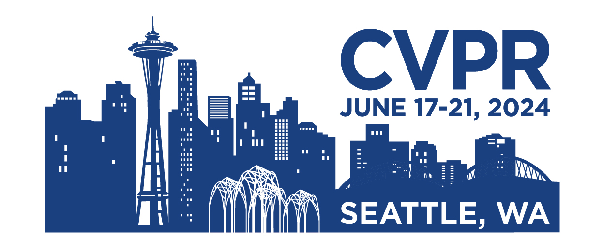
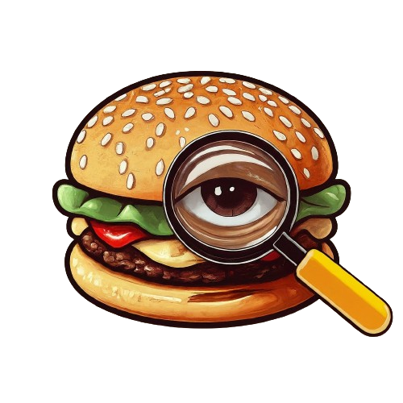
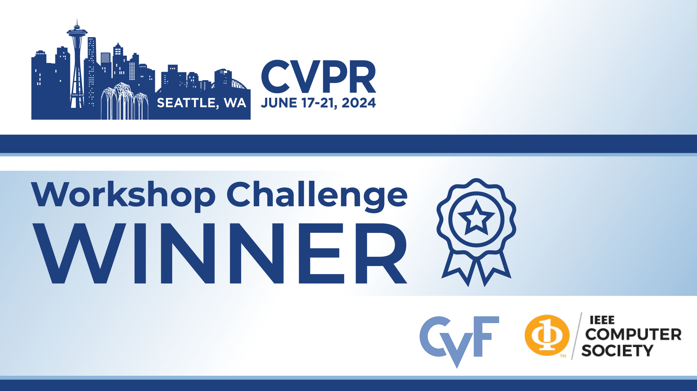

# FoodRiddle-MetaFood-CVPR2024


## Overview
 

This project is developed for the [CVPR MetaFood 2024 Workshop Challenge](https://sites.google.com/view/cvpr-metafood-2024/challenge).

The goal of our project is to accurately model and analyze food through 3D reconstruction, volume estimation, and mesh reconstruction.


### Team FoodRiddle

### Team Members

- Yawei Jueluo: jueluoyawei@gmail.com
- Chengyu Shi: 493525977@qq.com
- Pengyu Wang： wangpengyu@bupt.edu.cn

### Features
- **3D Reconstruction**: High-precision 3D reconstruction using state-of-the-art computer vision techniques.
- **Volume Estimation**: Accurate volume estimation through advanced algorithms.
- **Mesh Reconstruction**: High-quality mesh reconstruction addressing the problem of incomplete edges.

## Dataset

We used the [MetaFood 2024 Challenge Dataset](https://sites.google.com/view/cvpr-metafood-2024/challenge) for training and evaluating our models.


### Data Preparation
1. Download the dataset from the provided link.
2. Preprocess the data using the provided scripts:
    ```bash
    python scripts/preprocess_data.py --input_path /path/to/data --output_path /path/to/preprocessed_data
    ```

## Installation and Dependencies
### Environment Setup
Ensure you have the following environment:
- Python version: 3.8+
- CUDA version: 11.0+ (if using GPU)

### Dependencies
Install all dependencies using the following command:
```bash
pip install -r requirements.txt

